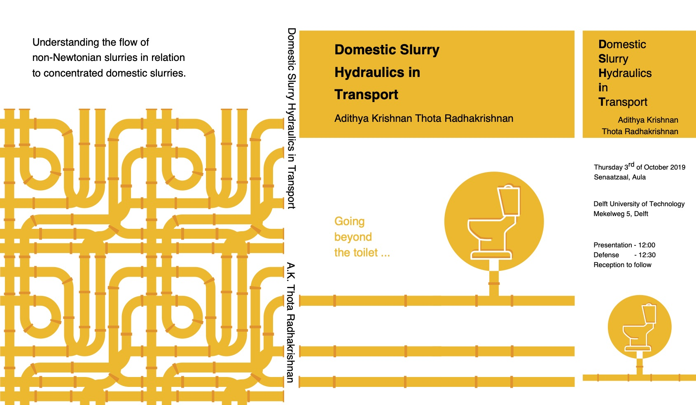

# D-SHIT : Domestic Slurry Hydraulics in Transport systems

[***Thesis can be found here***](https://repository.tudelft.nl/islandora/object/uuid%3Aef44e517-ca14-46a8-93e4-43c38b265b30?collection=research)

**Abstract**

Domestic wastewater streams from households implemented with source separation, vacuum toilets, and food waste disposers are highly concentrated with respect to the total suspended solids. The concentrated domestic slurries (CDS), which generally consist of faecal matter, urine, ground kitchen waste (GKW) and water, need to be transported from the point of collection to its treatment. In order to design a transportation systems to convey CDS, its flow characteristics must be known. The objective of this thesis is to establish the flow characteristics of CDS that supports the design of its transportation system with pressurised pipelines. CDS is characterised as a non-Newtonian fluid with respect to its rheology. It has a shear-thinning property with a yield stress. However, at low concentrations it behaves as a Newtonian fluid, its non-Newtonian properties are only physically meaningful above a concentration of 2.0 % TSS (wt./wt.). The rheology of CDS is represented using a Herschel-Bulkley model, the parameters of which are a function of TSS concentration which describes the influence of concentration changes. The yield-stress follows a power law function with concentration and is significant only above a concentration of 2.0 % TSS (wt./wt.). The consistency index follows an exponential behaviour with the concentration, which tends towards the viscosity of water at low TSS concentration. The behaviour index follows an inverse logarithmic function decreasing from 1, and this change is significant only above a TSS concentration of 2.6 % (wt./wt.). The temperature of the slurry also influence the rheology of CDS. The influence of temperature is represented using an Arrhenius type equation with respect to the apparent viscosity. On the other hand, the influence of installing food waste disposers is reflected on the change in the overall particle size distribution (PSD) of the slurry, where an increase in the effective diameter of the particle shows an increase in the viscosity of the slurry. The pressure losses incurred in the transport of non-Newtonian slurries, including CDS, in pressurised pipelines are well represented using the Slatter transport model. The pressure loses are very much impacted by the rheological characteristics of the fluid. The pressure losses incurred increase with the increase in TSS concentration, but with the onset of non-Newtonian behaviour, the yield-stress and shear-thinning behaviour, provide some damping to the pressure losses particularly in the turbulent flow regime. The transition from laminar to turbulent flow occurs as a multi-stage process starting with the occurrence of puffs, and then to slugs and both together. The Slatter Reynolds number, provides good prediction of the transition to turbulence compared to the other available models. To conclude, a functional design of a pressurised pipeline transport system for CDS would have to meet the pressure losses estimated using the rheology of CDS at a certain concentration of TSS and temperature of the slurry.

**Author**

Thota Radhakrishnan, A.K.

**Promotors**

Clemens, F.H.L.R., van Lier, J.B.

**Degree granting institution**

Delft University of Technology

**Date**

2019-10-03

**To reference this document use:**

[https://doi.org/10.4233/uuid:ef44e517-ca14-46a8-93e4-43c38b265b30](https://doi.org/10.4233/uuid:ef44e517-ca14-46a8-93e4-43c38b265b30)

**ISBN**

978-94-6366-208-6

**Rights**

© 2019 A.K. Thota Radhakrishnan