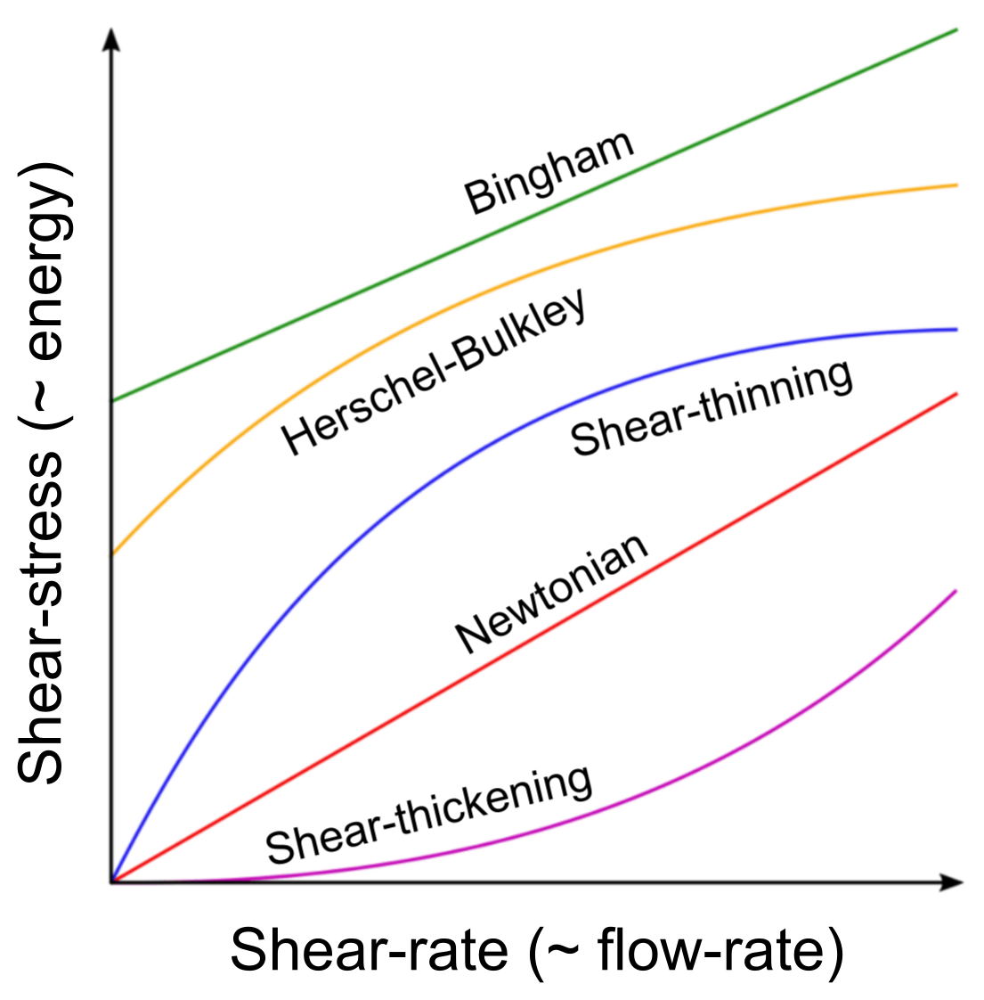

# Rheology

Rheology is the characterisation of fluids based on their flow properties. It determines the of viscosity of the fluid, which provides a sense of how easy or difficult it is to make the fluid flow. Some fluids flow straight away, like water. The amount of energy required to keep water flowing increases proportionally with how fast you want it to flow (flow-rate). These are called Newtonian fluids.

A fluid that takes a lot more energy initially to get it to flow and eases off as its flow rate increases is called a shear-thinning fluid, of which tomato pulp (sauce) is one. A fluid which takes a threshold of energy to overcome resistance and start flowing proportional to the energy given is called a Bingham fluid, of which Mayonnaise is one. This threshold of energy for fluids to overcome its initial resistance is called Yield stress. Fluids that posses both a shear-thinning behaviour and yield-stress resistance are called Herschel-Buckley fluid, of which honey and ketchup are one. Remember tapping the bottle of ketchup and squeezing it hard to get it to flow, that is the yield stress you are trying to overcome.

On the other hand there is a type of fluid, that is completely counter-intuitive, shear-thickening fluid. Which is very easy to make it to flow at low flow rates, and becomes difficult (close to a solid) as the flow rate increases. An example is quicksand (a particular concentration of fine sand in water) and Oobleck (a particular concentration of corn starch in water).

Here is a sort of illustration to depict the different fluids:

<figure>

<figcaption>
Figure: Energy (as Sheart-stress) vs. Flow-rate (as Shear-rate) for fluids. Energy required/applied is an equivalent of shear-stress on the fluid and the flow rate is an equivalent of shear-rate. This analogy is used to only explain the phenomena is simple language.
</figcaption>

</figure>

Fascinating stuff fluids are! The fine structures of the particles in the fluid and the forces between them influence so much of how they behave. The different combinations make them radically different in their behaviour.
