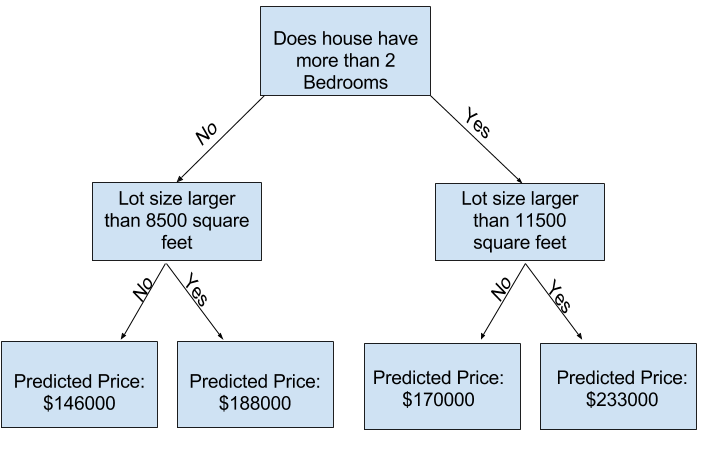
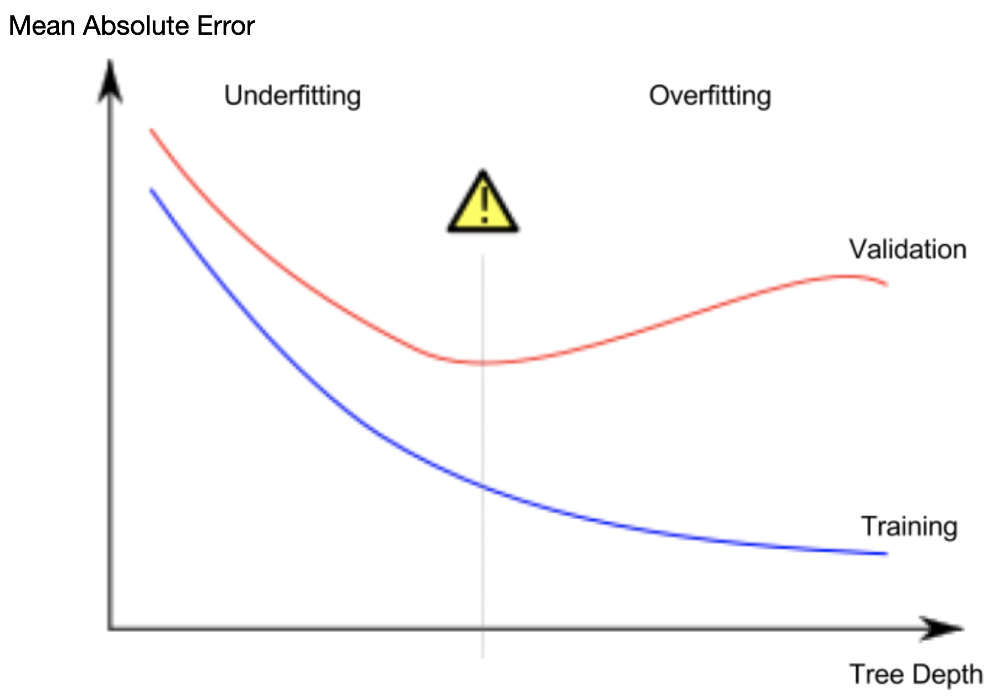

# Machine Learning

## Data exploration

```python
# save filepath to variable for easier access
melbourne_file_path = '../input/melbourne-housing-snapshot/melb_data.csv'

# read the data and store data in DataFrame titled melbourne_data
melbourne_data = pd.read_csv(melbourne_file_path)

# print a summary of the data in Melbourne data
melbourne_data.describe()
```

# Clean data

```python
# The Melbourne data has some missing values (some houses for which some variables weren't recorded.)
# We'll learn to handle missing values in a later tutorial.
# Your Iowa data doesn't have missing values in the columns you use.
# So we will take the simplest option for now, and drop houses from our data.
# Don't worry about this much for now, though the code is:

# dropna drops missing values (think of na as "not available")
melbourne_data = melbourne_data.dropna(axis=0)
```

# Selecting prediction target

```
y = melbourne_data.Price
```

# Choosing features

```python
melbourne_features = ['Rooms', 'Bathroom', 'Landsize', 'Lattitude', 'Longtitude']

X = melbourne_data[melbourne_features]
```

## Building the model

The steps to building and using a model are:

-   **Define:** What type of model will it be? A decision tree? Some other type of model? Some other parameters of the model type are specified too.
-   **Fit:** Capture patterns from provided data. This is the heart of modeling.
-   **Predict:** Just what it sounds like
-   **Evaluate**: Determine how accurate the model's predictions are.

```python
from sklearn.tree import DecisionTreeRegressor

# Define model. Specify a number for random_state to ensure same results each run
melbourne_model = DecisionTreeRegressor(random_state=1)

# Fit model
melbourne_model.fit(X, y)
```

```
print("Making predictions for the following 5 houses:")
print(X.head())

print("The predictions are")
print(melbourne_model.predict(X.head()))
```

## Decision tree



## Model quality

There are many metrics for summarizing model quality, but we'll start with one called **Mean Absolute Error** (also called **MAE**).

```python
error = actual − predicted
```

```python
from sklearn.metrics import mean_absolute_error

predicted_home_prices = melbourne_model.predict(X)
mean_absolute_error(y, predicted_home_prices)
```

## Validating the model

Since models' practical value come from making predictions on new data, we measure performance on data that wasn't used to build the model. The most straightforward way to do this is to exclude some data from the model-building process, and then use those to test the model's accuracy on data it hasn't seen before. This data is called **validation data**.

```python
from sklearn.model_selection import train_test_split

# split data into training and validation data, for both features and target
# The split is based on a random number generator. Supplying a numeric value to
# the random_state argument guarantees we get the same split every time we
# run this script.
train_X, val_X, train_y, val_y = train_test_split(X, y, random_state = 0)
# Define model
melbourne_model = DecisionTreeRegressor()
# Fit model
melbourne_model.fit(train_X, train_y)

# get predicted prices on validation data
val_predictions = melbourne_model.predict(val_X)
print(mean_absolute_error(val_y, val_predictions))
```

## Different models

There are different models that can be explored. Scikit-learn's [documentation](http://scikit-learn.org/stable/modules/generated/sklearn.tree.DecisionTreeRegressor.html) that the decision tree model has many options.

A phenomenon called **overfitting**, where a model matches the training data almost perfectly, but does poorly in validation and other new data. When a model fails to capture important distinctions and patterns in the data, so it performs poorly even in training data, that is called **underfitting**.



```python
from sklearn.metrics import mean_absolute_error
from sklearn.tree import DecisionTreeRegressor

# Function to return the MAE for different parameters of the decision tree model.

def get_mae(max_leaf_nodes, train_X, val_X, train_y, val_y):
    model = DecisionTreeRegressor(max_leaf_nodes=max_leaf_nodes, random_state=0)
    model.fit(train_X, train_y)
    preds_val = model.predict(val_X)
    mae = mean_absolute_error(val_y, preds_val)
    return(mae)
```

```python
# compare MAE with differing values of max_leaf_nodes
for max_leaf_nodes in [5, 50, 500, 5000]:
    my_mae = get_mae(max_leaf_nodes, train_X, val_X, train_y, val_y)
    print("Max leaf nodes: %d  \t\t Mean Absolute Error:  %d" %(max_leaf_nodes, my_mae))
```

Max leaf nodes: 5 Mean Absolute Error: 347380
Max leaf nodes: 50 Mean Absolute Error: 258171
Max leaf nodes: 500 Mean Absolute Error: 243495
Max leaf nodes: 5000 Mean Absolute Error: 254983

## Random forests

The random forest uses many trees, and it makes a prediction by averaging the predictions of each component tree. It generally has much better predictive accuracy than a single decision tree and it works well with default parameters.

[Scikit-Learn-Random-Forest-Regressor](https://scikit-learn.org/stable/modules/generated/sklearn.ensemble.RandomForestRegressor.html?highlight=random%20forest#sklearn.ensemble.RandomForestRegressor)

```python
from sklearn.ensemble import RandomForestRegressor
from sklearn.metrics import mean_absolute_error

forest_model = RandomForestRegressor(random_state=1)
forest_model.fit(train_X, train_y)
melb_preds = forest_model.predict(val_X)
print(mean_absolute_error(val_y, melb_preds))
```

## Cleaning data part 2

```python
from sklearn.ensemble import RandomForestRegressor
from sklearn.metrics import mean_absolute_error

# Function for comparing different approaches
def score_dataset(X_train, X_valid, y_train, y_valid):
    model = RandomForestRegressor(n_estimators=10, random_state=0)
    model.fit(X_train, y_train)
    preds = model.predict(X_valid)
    return mean_absolute_error(y_valid, preds)
```

1. **Drop columns and/or rows** with missing values
2. **Imputation** fills in the missing values with some number.
3. **Extended imputation** we impute the missing values, as before. And, additionally, for each column with missing entries in the original dataset, we add a new column that shows the location of the imputed entries. Adding `True` or `False ` to the imputed data by row or column.

```python
# Get names of columns with missing values
cols_with_missing = [col for col in X_train.columns
                     if X_train[col].isnull().any()]

# Drop columns in training and validation data
reduced_X_train = X_train.drop(cols_with_missing, axis=1)
reduced_X_valid = X_valid.drop(cols_with_missing, axis=1)
```

```python
from sklearn.impute import SimpleImputer

# Imputation
# SimpleIMputer to replace it by the mean value along the column.
my_imputer = SimpleImputer()
imputed_X_train = pd.DataFrame(my_imputer.fit_transform(X_train))
imputed_X_valid = pd.DataFrame(my_imputer.transform(X_valid))

# Imputation removed column names; put them back
imputed_X_train.columns = X_train.columns
imputed_X_valid.columns = X_valid.columns
```

```python
# Make copy to avoid changing original data (when imputing)
X_train_plus = X_train.copy()
X_valid_plus = X_valid.copy()

# Make new columns indicating what will be imputed
for col in cols_with_missing:
    X_train_plus[col + '_was_missing'] = X_train_plus[col].isnull()
    X_valid_plus[col + '_was_missing'] = X_valid_plus[col].isnull()

# Imputation
my_imputer = SimpleImputer()
imputed_X_train_plus = pd.DataFrame(my_imputer.fit_transform(X_train_plus))
imputed_X_valid_plus = pd.DataFrame(my_imputer.transform(X_valid_plus))

# Imputation removed column names; put them back
imputed_X_train_plus.columns = X_train_plus.columns
imputed_X_valid_plus.columns = X_valid_plus.columns

print("MAE from Approach 3 (An Extension to Imputation):")
print(score_dataset(imputed_X_train_plus, imputed_X_valid_plus, y_train, y_valid))
```

**Categorical variables**

1. **Drop Categorical Variables** remove them from the dataset. This approach will only work well if the columns did not contain useful information.
2. **Ordinal Encoding** box them into categories and label them with numbers. Works well with tree based models decision and random forest.
3. **One-Hot Encoding** suppose an color is given, enocde each of them into three column values of each R G B. One-hot encoding generally does not perform well if the categorical variable takes on a large number of values (i.e., you generally won't use it for variables taking more than 15 different values).

```python
# String object types are considered to be of categorical.

# Get list of categorical variables

s = (X_train.dtypes == 'object')
object_cols = list(s[s].index)

print("Categorical variables:")
print(object_cols)
```

```python
drop_X_train = X_train.select_dtypes(exclude=['object'])
drop_X_valid = X_valid.select_dtypes(exclude=['object'])

print("MAE from Approach 1 (Drop categorical variables):")
print(score_dataset(drop_X_train, drop_X_valid, y_train, y_valid))
```

```python
from sklearn.preprocessing import OrdinalEncoder

# Make copy to avoid changing original data
label_X_train = X_train.copy()
label_X_valid = X_valid.copy()

# Apply ordinal encoder to each column with categorical data
ordinal_encoder = OrdinalEncoder()
label_X_train[object_cols] = ordinal_encoder.fit_transform(X_train[object_cols])
label_X_valid[object_cols] = ordinal_encoder.transform(X_valid[object_cols])

print("MAE from Approach 2 (Ordinal Encoding):")
print(score_dataset(label_X_train, label_X_valid, y_train, y_valid))
```

the [`OneHotEncoder`](https://scikit-learn.org/stable/modules/generated/sklearn.preprocessing.OneHotEncoder.html) class from scikit-learn to get one-hot encodings. There are a number of parameters that can be used to customize its behavior.

-   We set `handle_unknown='ignore'` to avoid errors when the validation data contains classes that aren't represented in the training data, and
-   setting `sparse=False` ensures that the encoded columns are returned as a numpy array (instead of a sparse matrix).

To use the encoder, we supply only the categorical columns that we want to be one-hot encoded. For instance, to encode the training data, we supply `X_train[object_cols]`. (`object_cols` in the code cell below is a list of the column names with categorical data, and so `X_train[object_cols]` contains all of the categorical data in the training set.)

```python
from sklearn.preprocessing import OneHotEncoder

# Apply one-hot encoder to each column with categorical data
OH_encoder = OneHotEncoder(handle_unknown='ignore', sparse=False)
OH_cols_train = pd.DataFrame(OH_encoder.fit_transform(X_train[object_cols]))
OH_cols_valid = pd.DataFrame(OH_encoder.transform(X_valid[object_cols]))

# One-hot encoding removed index; put it back
OH_cols_train.index = X_train.index
OH_cols_valid.index = X_valid.index

# Remove categorical columns (will replace with one-hot encoding)
num_X_train = X_train.drop(object_cols, axis=1)
num_X_valid = X_valid.drop(object_cols, axis=1)

# Add one-hot encoded columns to numerical features
OH_X_train = pd.concat([num_X_train, OH_cols_train], axis=1) # axis = 1 since they share same row numbers.
OH_X_valid = pd.concat([num_X_valid, OH_cols_valid], axis=1)

print("MAE from Approach 3 (One-Hot Encoding):")
print(score_dataset(OH_X_train, OH_X_valid, y_train, y_valid))
```

Usage of `set`

```python
# Categorical columns in the training data
object_cols = [col for col in X_train.columns if X_train[col].dtype == "object"]

# Columns that can be safely ordinal encoded
good_label_cols = [col for col in object_cols if
                   set(X_valid[col]).issubset(set(X_train[col]))]

# Problematic columns that will be dropped from the dataset
bad_label_cols = list(set(object_cols)-set(good_label_cols))

print('Categorical columns that will be ordinal encoded:', good_label_cols)
print('\nCategorical columns that will be dropped from the dataset:', bad_label_cols)
```

## Pipelines

**Pipelines** are a simple way to keep your data preprocessing and modeling code organized. Specifically, a pipeline bundles preprocessing and modeling steps so you can use the whole bundle as if it were a single step.

Many data scientists hack together models without pipelines, but pipelines have some important benefits. Those include:

1.  **Cleaner Code:** Accounting for data at each step of preprocessing can get messy. With a pipeline, you won't need to manually keep track of your training and validation data at each step.
2.  **Fewer Bugs:** There are fewer opportunities to misapply a step or forget a preprocessing step.
3.  **Easier to Productionize:** It can be surprisingly hard to transition a model from a prototype to something deployable at scale. We won't go into the many related concerns here, but pipelines can help.
4.  **More Options for Model Validation:** You will see an example in the next tutorial, which covers cross-validation.

We construct the full pipeline in three steps.

### Step 1: Define Preprocessing Steps

Similar to how a pipeline bundles together preprocessing and modeling steps, we use the `ColumnTransformer` class to bundle together different preprocessing steps. The code below:

-   imputes missing values in **_numerical_** data, and
-   imputes missing values and applies a one-hot encoding to **_categorical_** data.

```python
from sklearn.compose import ColumnTransformer
from sklearn.pipeline import Pipeline
from sklearn.impute import SimpleImputer
from sklearn.preprocessing import OneHotEncoder

# Preprocessing for numerical data
numerical_transformer = SimpleImputer(strategy='constant')

# Preprocessing for categorical data
categorical_transformer = Pipeline(steps=[
    ('imputer', SimpleImputer(strategy='most_frequent')),
    ('onehot', OneHotEncoder(handle_unknown='ignore'))
])

# Bundle preprocessing for numerical and categorical data
preprocessor = ColumnTransformer(
    transformers=[
        ('num', numerical_transformer, numerical_cols),
        ('cat', categorical_transformer, categorical_cols)
    ])
```

### Step 2: Define the Model

Next, we define a random forest model with the familiar [`RandomForestRegressor`](https://scikit-learn.org/stable/modules/generated/sklearn.ensemble.RandomForestRegressor.html) class.

```python
from sklearn.ensemble import RandomForestRegressor

model = RandomForestRegressor(n_estimators=100, random_state=0)
```

### Step 3: Create and Evaluate the Pipeline[](https://www.kaggle.com/code/alexisbcook/pipelines#Step-3:-Create-and-Evaluate-the-Pipeline)

Finally, we use the [`Pipeline`](https://scikit-learn.org/stable/modules/generated/sklearn.pipeline.Pipeline.html) class to define a pipeline that bundles the preprocessing and modeling steps. There are a few important things to notice:

-   With the pipeline, we preprocess the training data and fit the model in a single line of code. (_In contrast, without a pipeline, we have to do imputation, one-hot encoding, and model training in separate steps. This becomes especially messy if we have to deal with both numerical and categorical variables!_)
-   With the pipeline, we supply the unprocessed features in `X_valid` to the `predict()` command, and the pipeline automatically preprocesses the features before generating predictions. (_However, without a pipeline, we have to remember to preprocess the validation data before making predictions._)

```python

from sklearn.metrics import mean_absolute_error

# Bundle preprocessing and modeling code in a pipeline
my_pipeline = Pipeline(steps=[('preprocessor', preprocessor),
                              ('model', model)
                             ])

# Preprocessing of training data, fit model
my_pipeline.fit(X_train, y_train)

# Preprocessing of validation data, get predictions
preds = my_pipeline.predict(X_valid)

# Evaluate the model
score = mean_absolute_error(y_valid, preds)
print('MAE:', score)
```

## Cross validation

In **cross-validation**, we run our modeling process on different subsets of the data to get multiple measures of model quality.

-   _For small datasets_, where extra computational burden isn't a big deal, you should run cross-validation.
-   _For larger datasets_, a single validation set is sufficient. Your code will run faster, and you may have enough data that there's little need to re-use some of it for holdout.

There's no simple threshold for what constitutes a large vs. small dataset. But if your model takes a couple minutes or less to run, it's probably worth switching to cross-validation.

Alternatively, you can run cross-validation and see if the scores for each experiment seem close. If each experiment yields the same results, a single validation set is probably sufficient.

```python
from sklearn.ensemble import RandomForestRegressor
from sklearn.pipeline import Pipeline
from sklearn.impute import SimpleImputer

my_pipeline = Pipeline(steps=[('preprocessor', SimpleImputer()),
                               ('model', RandomForestRegressor(n_estimators=50, random_state=0))
                               ])
```

```python
from sklearn.model_selection import cross_val_score

# Multiply by -1 since sklearn calculates *negative* MAE
scores = -1 * cross_val_score(my_pipeline, X, y,
                              cv=5,
                              scoring='neg_mean_absolute_error')

print("MAE scores:\n", scores)
```

## [Data leakage](https://www.kaggle.com/code/alexisbcook/data-leakage#Introduction)

**Data leakage** (or **leakage**) happens when your training data contains information about the target, but similar data will not be available when the model is used for prediction. This leads to high performance on the training set (and possibly even the validation data), but the model will perform poorly in production.

**Target leakage**

**Target leakage** occurs when your predictors include data that will not be available at the time you make predictions. It is important to think about target leakage in terms of the *timing or chronological order* that data becomes available, not merely whether a feature helps make good predictions.

How to detect this? If a data feature changes or is influenced by an event after the value of the target is noted. People testing positive for covid and a column with taking specific medications for covid.

**Train-Test Contamination**

Validation is meant to be a measure of how the model does on data that it hasn't considered before. You can corrupt this process in subtle ways if the validation data affects the preprocessing behavior. This is sometimes called **train-test contamination**. If your validation is based on a simple train-test split, exclude the validation data from any type of *fitting*, including the fitting of preprocessing steps.

```python
from sklearn.pipeline import make_pipeline
from sklearn.ensemble import RandomForestClassifier
from sklearn.model_selection import cross_val_score

# Since there is no preprocessing, we don't need a pipeline (used anyway as best practice!)
my_pipeline = make_pipeline(RandomForestClassifier(n_estimators=100))
cv_scores = cross_val_score(my_pipeline, X, y,
                            cv=5,
                            scoring='accuracy')

print("Cross-validation accuracy: %f" % cv_scores.mean())
```

```python
expenditures_cardholders = X.expenditure[y]
expenditures_noncardholders = X.expenditure[~y]

print('Fraction of those who did not receive a card and had no expenditures: %.2f' \
      %((expenditures_noncardholders == 0).mean()))
print('Fraction of those who received a card and had no expenditures: %.2f' \
      %(( expenditures_cardholders == 0).mean()))
```

```python
# Drop leaky predictors from dataset
potential_leaks = ['expenditure', 'share', 'active', 'majorcards']
X2 = X.drop(potential_leaks, axis=1)

# Evaluate the model with leaky predictors removed
cv_scores = cross_val_score(my_pipeline, X2, y,
                            cv=5,
                            scoring='accuracy')

print("Cross-val accuracy: %f" % cv_scores.mean())
```

# XGBoost

## [Gradient Boosting](https://www.kaggle.com/code/alexisbcook/xgboost#Gradient-Boosting)

**Gradient boosting** is a method that goes through cycles to iteratively add models into an ensemble.

It begins by initializing the ensemble with a single model, whose predictions can be pretty naive. (Even if its predictions are wildly inaccurate, subsequent additions to the ensemble will address those errors.)

Then, we start the cycle:

-   First, we use the current ensemble to generate predictions for each observation in the dataset. To make a prediction, we add the predictions from all models in the ensemble.
-   These predictions are used to calculate a loss function (like [mean squared error](https://en.wikipedia.org/wiki/Mean_squared_error), for instance).
-   Then, we use the loss function to fit a new model that will be added to the ensemble. Specifically, we determine model parameters so that adding this new model to the ensemble will reduce the loss. (_Side note: The "gradient" in "gradient boosting" refers to the fact that we'll use [gradient descent](https://en.wikipedia.org/wiki/Gradient_descent) on the loss function to determine the parameters in this new model._)
-   Finally, we add the new model to ensemble, and ...
-   ... repeat!


```python
from xgboost import XGBRegressor

my_model = XGBRegressor()
my_model.fit(X_train, y_train)
```

```python
from sklearn.metrics import mean_absolute_error

predictions = my_model.predict(X_valid)
print("Mean Absolute Error: " + str(mean_absolute_error(predictions, y_valid)))
```

### [`n_estimators`](https://www.kaggle.com/code/alexisbcook/xgboost#n_estimators)

`n_estimators` specifies how many times to go through the modeling cycle, and equal to the number of models that we include in the ensemble. Too *low* a value causes *underfitting*, Too *high* a value causes *overfitting*. Typical values range from 100-1000, though this depends a lot on the `learning_rate` parameter discussed below.

```python
my_model = XGBRegressor(n_estimators=500)
my_model.fit(X_train, y_train)
```

### [`early_stopping_rounds`](https://www.kaggle.com/code/alexisbcook/xgboost#early_stopping_rounds)

`early_stopping_rounds` offers a way to automatically find the ideal value for `n_estimators`, causes the model to stop iterating when the validation score stops improving. Set a high value for `n_estimators` and then use `early_stopping_rounds`. Setting `early_stopping_rounds=5` is a reasonable choice, to stop after 5 straight rounds of deteriorating validation scores. Using `early_stopping_rounds`, you set aside some data for calculating the validation scores - by setting the `eval_set` parameter.

```python
my_model = XGBRegressor(n_estimators=500)
my_model.fit(X_train, y_train,
             early_stopping_rounds=5,
             eval_set=[(X_valid, y_valid)],
             verbose=False)
```

### [`learning_rate`](https://www.kaggle.com/code/alexisbcook/xgboost#learning_rate)

We can multiply the predictions from each model by a small number (known as the **learning rate**) before adding them in. We can set a higher value for `n_estimators` without overfitting. A small learning rate and large number of estimators will yield more accurate XGBoost models.

```python
my_model = XGBRegressor(n_estimators=1000, learning_rate=0.05)
my_model.fit(X_train, y_train,
             early_stopping_rounds=5,
             eval_set=[(X_valid, y_valid)],
             verbose=False)
```

### [`n_jobs`](https://www.kaggle.com/code/alexisbcook/xgboost#n_jobs)

You can use parallelism to build your models faster. Set the parameter `n_jobs` equal to the number of cores on your machine. Useful in large datasets where you would otherwise spend a long time waiting during the `fit` command. On smaller datasets, this won't help.

```python
my_model = XGBRegressor(n_estimators=1000, learning_rate=0.05, n_jobs=4)
my_model.fit(X_train, y_train,
             early_stopping_rounds=5,
             eval_set=[(X_valid, y_valid)],
             verbose=False)
```

---

**References**

-   Scikit documentation
-   [Kaggle](https://www.kaggle.com/)
